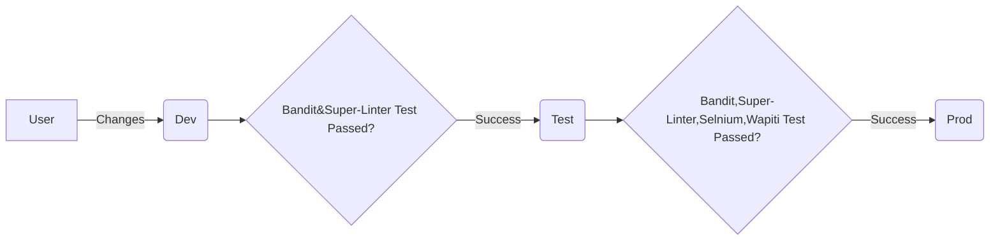

# Khaanvani Project

This repository hosts a Chatbot project that serves as an intelligent virtual assistant capable of responding to text queries related to various Acts, Rules, and Regulations applicable to the Mining industry. It's designed to make the information retrieval process more efficient and user-friendly for people in the mining sector.
## Features

- 24/7 availability
- Text queries
- Ease of use

## Tech Stack

Python

Natural Language Processing (NLP)

Pinecone

Tools:

Bandit for source code checking

wapiti for dynamic

Selenium for testing

Terraform for iac tool
## Demo
Visit our site at [khaanvaani.streamlit.app](https://khaanvaani.streamlit.app/)

## Our flowchart:

## Future

Regional languages

Voice search

Legal Representative

1 in chat

2 in call

